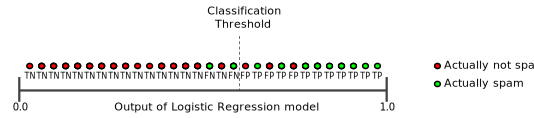

## Precision

What percentage of positive identifications was correct?

$precision = \frac{TP}{TP + FP}$

example: analyze tumors, predict 2 of 100 positive, presicion is 0.5.

Confusion matrix:

|||
|-|-|
|True Positives (TPs): 1|False Positives (FPs): 1|
|False Negatives (FNs): 8|True Negatives (TNs): 90|

## Recall

What percentage of actual positives was identified correctly?

$Recall = \frac{TP}{TP + FN} = \frac{1}{1 + 8} = 0.11$

With the example above, the model predicts 2 of 100 positive. Recall is 0.11.

## Accuracy

$Accuracy = \frac{number of correct predictions}{total number of predictions}$

For binary classification:

$Accuracy = \frac{TP+ TN}{TP+TN+FP+FN}$

With the example above, accuracy is 0.91.

Accuracy alone doesn't tell the full story when you're working with a class-imbalanced data set, like this one, where there is a significant disparity between the number of positive and negative labels.

## Prevision and Recall

Unfortunately, precision and recall are often in tension. That is, improving precision typically reduces recall and vice versa.

Explore this notion by looking at the following figure, which shows 30 predictions made by an email classification model. Those to the right of the classification threshold are classified as "spam", while those to the left are classified as "not spam."

|||
|-|-|
|True Positives (TPs): 8|False Positives (FPs): 2|
|False Negatives (FNs): 3|True Negatives (TNs): 17|

Precision is 0.8 (8/10) and recall is 0.73 (8/11).

Figure below illustrates the effect of increasing the classification threshold.

|||
|-|-|
|True Positives (TPs): 7|False Positives (FPs): 1|
|False Negatives (FNs): 4|True Negatives (TNs): 18|

Precision is 0.88 (7/8) and recall is 0.64 (7/11).

Conversely, figure below illustrates the effect of decreasing the classification threshold.

|||
|-|-|
|True Positives (TPs): 9|False Positives (FPs): 3|
|False Negatives (FNs): 2|True Negatives (TNs): 16|

Precision is 0.75 (9/12) and recall is 0.82 (9/11).

## Classification: ROC Curve and AUC

An ROC curve (receiver operating characteristic curve) is a graph showing the performance of a classification model at all classification thresholds.
