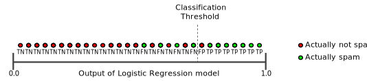
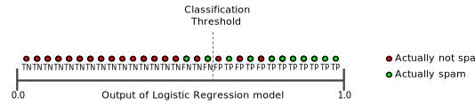
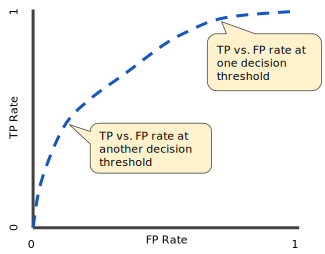

# Classification

## Precision

What percentage of positive identifications was correct?

$precision = \frac{TP}{TP + FP}$

example: analyze tumors, predict 2 of 100 positive, presicion is 0.5.

Confusion matrix:

|||
|-|-|
|True Positives (TPs): 1|False Positives (FPs): 1|
|False Negatives (FNs): 8|True Negatives (TNs): 90|

## Recall

What percentage of actual positives was identified correctly?

$Recall = \frac{TP}{TP + FN} = \frac{1}{1 + 8} = 0.11$

With the example above, the model predicts 2 of 100 positive. Recall is 0.11.

## Accuracy

$Accuracy = \frac{number of correct predictions}{total number of predictions}$

For binary classification:

$Accuracy = \frac{TP+ TN}{TP+TN+FP+FN}$

With the example above, accuracy is 0.91.

Accuracy alone doesn't tell the full story when you're working with a class-imbalanced data set, like this one, where there is a significant disparity between the number of positive and negative labels.

## Precision and Recall

Unfortunately, precision and recall are often in tension. That is, improving precision typically reduces recall and vice versa.

Explore this notion by looking at the following figure, which shows 30 predictions made by an email classification model. Those to the right of the classification threshold are classified as "spam", while those to the left are classified as "not spam."

|||
|-|-|
|True Positives (TPs): 8|False Positives (FPs): 2|
|False Negatives (FNs): 3|True Negatives (TNs): 17|

Precision is 0.8 (8/10) and recall is 0.73 (8/11).

Figure below illustrates the effect of increasing the classification threshold.

|||
|-|-|
|True Positives (TPs): 7|False Positives (FPs): 1|
|False Negatives (FNs): 4|True Negatives (TNs): 18|

Precision is 0.88 (7/8) and recall is 0.64 (7/11).

Conversely, figure below illustrates the effect of decreasing the classification threshold.

|||
|-|-|
|True Positives (TPs): 9|False Positives (FPs): 3|
|False Negatives (FNs): 2|True Negatives (TNs): 16|

Precision is 0.75 (9/12) and recall is 0.82 (9/11).

## Classification: ROC Curve and AUC

An ROC curve (receiver operating characteristic curve) is a graph showing the performance of a classification model at all classification thresholds. It plots TPR (true positive rate,recall, on y axis) vs. FPR (false positive rate, on x axis).

An ROC curve plots TPR vs. FPR at different classification thresholds. Lowering the classification threshold classifies more items as positive, thus increasing both False Positives and True Positives. The following figure shows a typical ROC curve.

To compute the points in an ROC curve, we could evaluate a logistic regression model many times with different classification thresholds, but this would be inefficient. Fortunately, there's an efficient, sorting-based algorithm that can provide this information for us, called AUC.

**AUC: Area Under the ROC Curve**

AUC stands for "Area under the ROC Curve." That is, AUC measures the entire two-dimensional area underneath the entire ROC curve (think integral calculus) from (0,0) to (1,1).

AUC provides an aggregate measure of performance across all possible classification thresholds. One way of interpreting AUC is as the probability that the model ranks a random positive example more highly than a random negative example. For example, given the following examples, which are arranged from left to right in ascending order of logistic regression predictions:

AUC represents the probability that a random positive (green) example is positioned to the right of a random negative (red) example.

AUC ranges in value from 0 to 1. A model whose predictions are 100% wrong has an AUC of 0.0; one whose predictions are 100% correct has an AUC of 1.0.

AUC is desirable for the following two reasons:

- AUC is scale-invariant. It measures how well predictions are ranked, rather than their absolute values.
- AUC is classification-threshold-invariant. It measures the quality of the model's predictions irrespective of what classification threshold is chosen.

However, both these reasons come with caveats, which may limit the usefulness of AUC in certain use cases:

- Scale invariance is not always desirable. For example, sometimes we really do need well calibrated probability outputs, and AUC won’t tell us about that.
- Classification-threshold invariance is not always desirable. In cases where there are wide disparities in the cost of false negatives vs. false positives, it may be critical to minimize one type of classification error. For example, when doing email spam detection, you likely want to prioritize minimizing false positives (even if that results in a significant increase of false negatives). AUC isn't a useful metric for this type of optimization.
