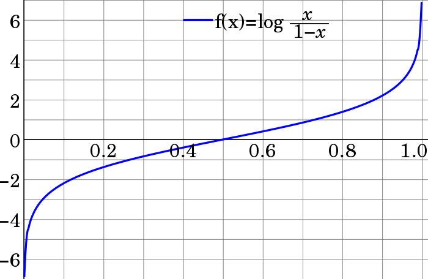

## Odds Ratio

Odds ratios are an alternate way of expressing probabilities, which simplifies the process of updating them with new evidence. The odds ratio of A is P(A)/P(¬A).

$P(A|B) = P(B|A)\frac{P(A)}{P(B)}$

$P(\neg A|B) = P(B|\neg A)\frac{P(\neg A)}{P(B)}$

divide the two equations above

$\frac{P(A|B)}{P(\neg A|B)} = \frac{P(B|A)}{P(B|\neg A)}\frac{P(A)}{P(\neg A)}$

Thus, in order to find the posterior odds ratio $\displaystyle {\frac {P(A|B)}{P(\neg A|B)}}$, one simply multiplies the prior odds ratio ${\displaystyle {\frac {P(A)}{P(\neg A)}}}$ by the likelihood ratio ${\displaystyle {\frac {P(B|A)}{P(B|\neg A)}}}$.

Odds ratios are commonly written as the ratio of two numbers separated by a colon. For example, if $P(A) = 2/3$, the odds ratio would be 2, but this would most likely be written as 2:1.

The relation between odds ratio, $a:b$, and probability, $p_a$ is as follows:

$\displaystyle a:b=p_a:(1-p_a)$

$\displaystyle p_a={\frac {a}{a+b}}$

[lesswrong wiki odds ratio](https://wiki.lesswrong.com/wiki/Odds_ratio)

## Log Odds

Log odds are an alternate way of expressing probabilities, which simplifies the process of updating them with new evidence. Unfortunately, it is difficult to convert between probability and log odds. The log odds is the log of the odds ratio. Thus, the log odds of A are

${\displaystyle logit\left(P(A)\right)} = log(P(A)/P(¬A))$

$\displaystyle logit\left(P(A|B)\right) = \log \left( \frac{P(B|A)}{P(B|¬A)} \right) + \displaystyle logit\left((P(A)\right)$

Example: Suppose you have a box that has a 5% chance of containing a diamond. You also have a diamond detector that beeps half of the time if there is a diamond, and one fourth of the time if there is not. You wave the diamond detector over the box and it beeps.

The prior log odds of the box containing a diamond are ln(1/19) = -2.94. The log of the likelihood ratio of a beep is ln((1/2)/(1/4)) = ln(2) = 0.69. The posterior log odds are -2.94 + 0.69 = -2.23. This corresponds to an odds ratio of e^-2.23 = 0.108:1, and thus a probability of 0.108/1.108 = 0.097 = 9.7%. The correct answer is actually 9.5%. There was error due to rounding.

In statistics, the logit (/ˈloʊdʒɪt/ LOH-jit) function or the log-odds is the logarithm of the odds $p/(1 − p)$ where $p$ is probability. It is a type of function that creates a map of probability values from $[0,1]$ to ${\displaystyle (-\infty ,+\infty )}$. It is the inverse of the sigmoidal "logistic" function or logistic transform used in mathematics, especially in statistics.

In deep learning, the term logits layer is popularly used for the last neuron layer of neural networks used for classification tasks, which produce raw prediction values as real numbers ranging from ${\displaystyle (-\infty ,+\infty )}$.

[wiki logit](https://en.wikipedia.org/wiki/Logit)
