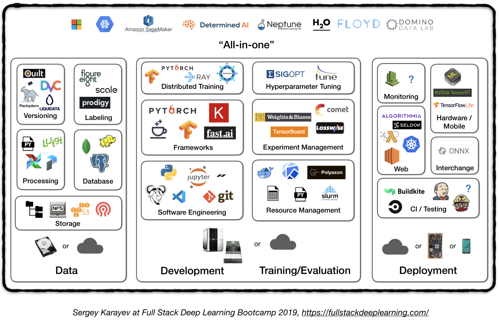

## Project Workflow

- Identify data set and use case
- ETL feature creation
- model definition and training
- model evaluation and tuning, deployment, documentation

The following figure represents a high level overview of different components in a production level deep learning system:

## 1. Data Management
### 1.1 Data Sources
* Supervised deep learning requires a lot of labeled data
* Labeling own data is costly!
* Here are some resources for data:
  * Open source data (good to start with, but not an advantage)
  * Data augmentation (a MUST for computer vision, an option for NLP)
  * Synthetic data (almost always worth starting with, esp. in NLP)
### 1.2  Data Labeling
* Requires: separate software stack (labeling platforms), temporary labor, and QC
* Sources of labor for labeling:
  * Crowdsourcing (Mechanical Turk): cheap and scalable, less reliable, needs QC
  * Hiring own annotators: less QC needed, expensive, slow to scale
  * Data labeling service companies:
    * [FigureEight](https://www.figure-eight.com/)
* Labeling platforms:
  * [Diffgram](https://diffgram.com/): Training Data Software (Computer Vision)
  * [Prodigy](https://prodi.gy/): An annotation tool powered
by active learning (by developers of Spacy), text and image
  * [HIVE](https://thehive.ai/): AI as a Service platform for computer vision
  * [Supervisely](https://supervise.ly/): entire computer vision platform
  * [Labelbox](https://labelbox.com/): computer vision
  * [Scale](https://scale.com/) AI data platform (computer vision & NLP)

  ### 1.3. Data Storage
* Data storage options:
  * **Object store**: Store binary data (images, sound files, compressed texts)
    * [Amazon S3](https://aws.amazon.com/s3/)
    * [Ceph](https://ceph.io/) Object Store
  * **Database**: Store metadata (file paths, labels, user activity, etc).
    * [Postgres](https://www.postgresql.org/) is the right choice for most of applications, with the best-in-class SQL and great support for unstructured JSON.
  * **Data Lake**: to aggregate features which are not obtainable from database (e.g. logs)
    * [Amazon Redshift](https://aws.amazon.com/redshift/)
  * **Feature Store**: store, access, and share machine learning features
 (Feature extraction could be computationally expensive and nearly impossible to scale, hence re-using features by different models and teams is a key to high performance ML teams).
    * [FEAST](https://github.com/gojek/feast) (Google cloud, Open Source)
    * [Michelangelo Palette](https://eng.uber.com/michelangelo/) (Uber)
* Suggestion: At training time, copy data into a local or networked **filesystem** (NFS). [1](#fsdl)

### 1.4. Data Versioning
* It's a "MUST" for deployed ML models:
  **Deployed ML models are part code, part data**. [1](#fsdl)  No data versioning means no model versioning.
* Data versioning platforms:
  * [DVC](https://dvc.org/): Open source version control system for ML projects
  * [Pachyderm](https://www.pachyderm.com/): version control for data
  * [Dolt](https://www.liquidata.co/): versioning for SQL database

  ### 1.5. Data Processing
* Training data for production models may come from different sources, including *Stored data in db and object stores*, *log processing*, and *outputs of other classifiers*.
* There are dependencies between tasks, each needs to be kicked off after its dependencies are finished. For example, training on new log data, requires a preprocessing step before training.
* Makefiles are not scalable. "Workflow manager"s become pretty essential in this regard.
* **Workflow orchestration:**
  * [Luigi](https://github.com/spotify/luigi) by Spotify
  * [Airflow](https://airflow.apache.org/) by Airbnb: Dynamic, extensible, elegant, and scalable (the most widely used)
      * DAG workflow
      * Robust conditional execution: retry in case of failure
      * Pusher supports docker images with tensorflow serving
      * Whole workflow in a single .py file

## 2. Development, Training, and Evaluation
### 2.1. Software engineering
* Winner language: Python
* Editors:
   * Vim
   * Emacs
   * [VS Code](https://code.visualstudio.com/) (Recommended by the author): Built-in git staging and diff, Lint code, open projects remotely through ssh
   * Notebooks: Great as starting point of the projects, hard to scale (fun fact: Netflix’s Notebook-Driven Architecture is an exception, which is entirely based on [nteract](https://nteract.io/) suites).
      * [nteract](https://nteract.io/): a next-gen React-based UI for Jupyter notebooks
      * [Papermill](https://github.com/nteract/papermill): is an [nteract](https://nteract.io/) library built for *parameterizing*, *executing*, and *analyzing* Jupyter Notebooks.
      * [Commuter](https://github.com/nteract/commuter): another [nteract](https://nteract.io/) project which provides a read-only display of notebooks (e.g. from S3 buckets).
   * [Streamlit](https://streamlit.io/): interactive data science tool with applets
 * Compute recommendations [1](#fsdl):
   * For *individuals* or *startups*:
     * Development: a 4x Turing-architecture PC
     * Training/Evaluation: Use the same 4x GPU PC. When running many experiments, either buy shared servers or use cloud instances.
   * For *large companies:*
     * Development: Buy a 4x Turing-architecture PC per ML scientist or let them use V100 instances
     * Training/Evaluation: Use cloud instances with proper provisioning and handling of failures
 * Cloud Providers:
   * GCP: option to connect GPUs to any instance + has TPUs
   * AWS:
### 2.2. Resource Management
  * Allocating free resources to programs
  * Resource management options:
    * Old school cluster job scheduler ( e.g. [Slurm](https://slurm.schedmd.com/) workload manager )
    * Docker + Kubernetes
    * Kubeflow
    * [Polyaxon](https://polyaxon.com/) (paid features)

## References
- https://github.com/alirezadir/Production-Level-Deep-Learning

- <a name="fsdl">[1]</a>: [Full Stack Deep Learning Bootcamp](https://fullstackdeeplearning.com/), Nov 2019.
- <a name="pipe">[2]</a>: [Advanced KubeFlow Workshop](https://www.meetup.com/Advanced-KubeFlow/) by [Pipeline.ai](https://pipeline.ai/), 2019.
- <a name="pipe">[3]</a>: [TFX: Real World Machine Learning in Production](https://cdn.oreillystatic.com/en/assets/1/event/298/TFX_%20Production%20ML%20pipelines%20with%20TensorFlow%20Presentation.pdf)
